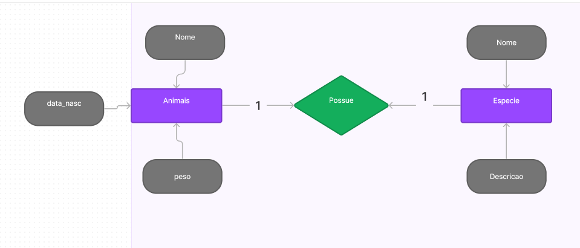
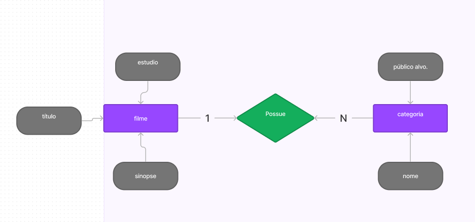
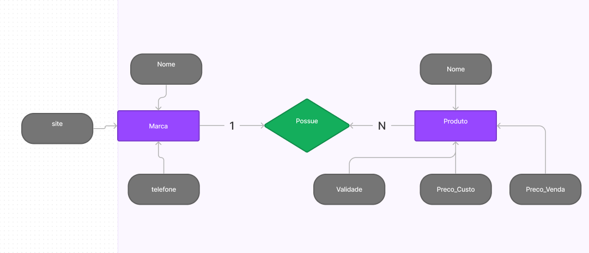

# Atividade individual - SQL 

Orientador: Daniel Oatha

<h1>--------ETAPA 1  ---------------</h1>

[Link Para Verificar o SQL](https://github.com/Leon14789/Atividade-individual---Tema--Base-de-Dados-Animais/blob/master/SQL-ETAPA-1)

<h1>-------- ---------------</h1>

[Link Para Verificar o SQL](https://github.com/Leon14789/Atividade-individual---Tema--Base-de-Dados-Animais/blob/master/SQL-ETAPA-2-ANIMAIS)

<h1>-------- ---------------</h1>

[Link Para Verificar o SQL](https://github.com/Leon14789/Atividade-individual---Tema--Base-de-Dados-Animais/blob/master/SQL-ETAPA-2-FILMES)

<h1>-------- ---------------</h1>

[Link Para Verificar o SQL](https://github.com/Leon14789/Atividade-individual---Tema--Base-de-Dados-Animais/blob/master/SQL-ETAPA-2-MARCA)

   
